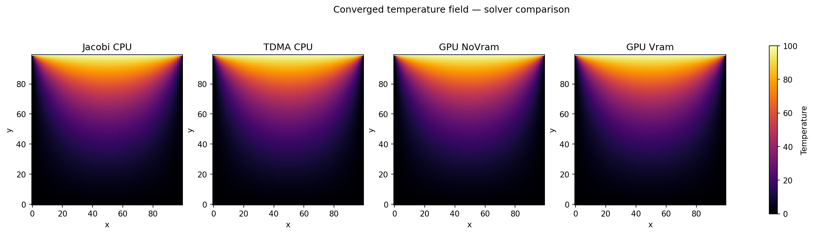

[](https://github.com/william4812/physi-sim/actions/workflows/ci.yml)


# physi-sim — HPC Thermal Solver

C++20 / Fortran 90 / CUDA 13.2 hybrid engine for 2D steady-state heat transfer.
GTX 1650 (sm_75, 16 SMs) · TDD · CI/CD · CMakePresets

Implements a modular `ISolver` interface with FSM-managed lifecycle, concurrent
dispatch, and a Fortran physics kernel pipeline. GPU acceleration via CUDA Jacobi
with per-step residual history and a `ProfilingHarness`. With buffers kept
**resident in VRAM** across the solve loop, the GPU solver now runs **~2.5×
faster than the CPU** at 100×100 — see §6.

---

## Table of contents

1. [Architecture](#1-architecture)
2. [Solver lifecycle — Finite State Machine](#2-solver-lifecycle--finite-state-machine)
3. [Physics verification](#3-physics-verification)
4. [Algorithm comparison — Jacobi vs TDMA](#4-algorithm-comparison--jacobi-vs-tdma)
5. [GPU profiling — the PCIe wall](#5-gpu-profiling--the-pcie-wall)
6. [VRAM residency — beating the CPU](#6-vram-residency--beating-the-cpu)
7. [Test suite — 92 passing](#7-test-suite--92-passing)
8. [Build and reproduce results](#8-build-and-reproduce-results)
9. [Roadmap and physics vision](#9-roadmap-and-physics-vision)

---

## 1. Architecture

Four strictly separated layers. C++ owns software design. Fortran owns numerical
physics. CUDA owns GPU compute. Python owns analytics.

```
┌──────────────────────────────────────────────────────────────────┐
│  C++ layer — software architecture                               │
│                                                                  │
│  ISolver (interface: step · residual · name · history)           │
│    ├── JacobiCPU          — Jacobi 5-point stencil (Fortran)    │
│    ├── TDMACPU            — Thomas algorithm line sweep          │
│    └── CudaJacobiSolver   — CUDA sm_75, 16×16 blocks  ✅        │
│                                                                  │
│  SolverFactory    — registry, HardwareBackend, parse CLI        │
│  SolverFSM        — atomic<SolverState>, throws on bad trans.   │
│  ProfilingHarness — wall_ms · iterations · fsm_state → CSV      │
│  ConcurrentSolverRunner — std::async dispatch                   │
└──────────────┬───────────────────────────────────────────────────┘
               │  extern "C" / Fortran bind(C)
               │  zero-overhead ABI, column-major layout
┌──────────────▼───────────────────────────────────────────────────┐
│  Fortran 90 layer — physics kernels (diffusion_kernel.f90)       │
│                                                                  │
│  laplace_2d_jacobi  — 5-point stencil, L∞ residual              │
│  laplace_2d_tdma    — row sweep, calls solve_tdma               │
│  solve_tdma         — PURE Thomas algorithm (thread-safe)        │
└──────────────┬───────────────────────────────────────────────────┘
               │  __global__ kernels / Thrust reduction
┌──────────────▼───────────────────────────────────────────────────┐
│  CUDA layer — GPU compute (src/cuda/)                            │
│                                                                  │
│  jacobi_kernel        — 16×16 thread blocks, sm_75              │
│  copy_boundary_kernel — halo preservation                        │
│  AbsDiff + thrust::max_element — L∞ residual reduction          │
│  VRAM-resident buffers — field stays on device across the loop  │
│  m_history            — per-step residual → convergence CSV     │
└──────────────┬───────────────────────────────────────────────────┘
               │  ProfilingHarness.writeCSV() + history()
┌──────────────▼───────────────────────────────────────────────────┐
│  Python analytics pipeline (python/)                             │
│                                                                  │
│  scripts/plot_convergence.py  — residual vs iteration           │
│  scripts/plot_walltime.py     — wall-time scaling + residency   │
│  scripts/plot_thermal_map.py  — VTK field heatmaps (no pyvista) │
│  scripts/make_figures.py      — one-run orchestrator (composes) │
│  legacy/                      — retired physi_analytics stack    │
└──────────────────────────────────────────────────────────────────┘
```

The C++ source mirrors these seams as independent CMake components:
`src/thermal` (Fortran bridge), `src/io` (VTK + config), `src/core` (FSM,
profiling, runner), `src/solver` (ISolver + factory), `src/cuda` (GPU). Each is
its own static library, linked into `physi_sim` and `physi_tests`.

---

## 2. Solver lifecycle — Finite State Machine

Every solver run is governed by `SolverFSM`. State stored as
`std::atomic<SolverState>` — safe to poll from a monitoring thread without a mutex.
Invalid transitions throw `std::logic_error` immediately.

```
IDLE ──prepare()──► READY ──start()──► RUNNING
                                           │
                               ┌───────────┴──────────┐
                           finish(true)         finish(false)
                               │                      │
                           CONVERGED               FAILED
                               └────────reset()────────┘
                                           │
                                         IDLE
```

| Transition | Pre-state | Post-state | On violation |
|------------|-----------|------------|--------------|
| `prepare()` | IDLE | READY | `std::logic_error` |
| `start()` | READY | RUNNING | `std::logic_error` |
| `finish(true)` | RUNNING | CONVERGED | `std::logic_error` |
| `finish(false)` | RUNNING | FAILED | `std::logic_error` |
| `reset()` | **any** | IDLE | — never throws |

`ProfilingHarness::run()` drives the full cycle: `prepare()` → `start()` →
iteration loop → `finish(converged)` → `reset()`. The terminal state is
serialised as `fsm_state` in every CSV row — correctness-tagged, not just timed.

The FSM also drives the benchmark driver in `main.cpp`:

```
BenchmarkState::INIT → RUNNING → WRITING → DONE
```

---

## 3. Physics verification

**Problem:** 2D steady-state Laplace equation, T_top = 100, all other boundaries = 0.

<p align="center">
  <br>
  <b>Figure 1 — Converged 100×100 temperature field (JacobiCPU).</b>
  Hot top edge (T = 100) diffusing into a cold interior — the expected
  steady-state harmonic profile.
</p>

All four solver variants — JacobiCPU, TDMACPU, GPU (per-step), and GPU
(VRAM-resident) — converge to the same field. Side by side they are visually
indistinguishable:

<p align="center">
  <br>
  <b>Figure 2 — Field parity across all four variants (100×100).</b>
  Differences sit at the level of floating-point reordering across 10⁴ parallel
  threads — orders of magnitude below the convergence tolerance.
</p>

Parity is enforced in CI by the comparison-variant tests
(`FieldMatchesCPUJacobiAfterConvergence`, tol = 5×10⁻⁴): a backend that drifts
from the CPU Jacobi reference fails the build.

---

## 4. Algorithm comparison — Jacobi vs TDMA

**Question:** under a common stopping criterion, how much faster does the
implicit line-by-line TDMA solver converge than explicit Jacobi?

<p align="center">
  <br>
  <b>Figure 3 — Jacobi vs LBL-TDMA convergence.</b>
  100×100 grid · relative increment residual ‖Tᵏ−Tᵏ⁻¹‖∞ / ‖T¹−T⁰‖∞ · tol = 1×10⁻⁷.
</p>

| Solver | Iterations to tol | Ratio |
|--------|-------------------|-------|
| JacobiCPU | 17,887 | 1× baseline |
| TDMACPU | 4,842 | **3.69× fewer** |

TDMA reaches tolerance in **3.69× fewer iterations** because each line sweep
propagates information across an entire row implicitly, while Jacobi relaxes one
neighbour at a time.

**Read this as per-iteration efficiency, not wall-clock speed.** Each TDMA
iteration costs ~7× more than a Jacobi sweep (a full Thomas forward+backward pass
per row), so in wall-clock terms Jacobi is actually faster at these grids — see
§5. The increment residual measures how fast the iteration *settles*; the true
solution error is the equation residual ‖b − A·T‖∞, which `ProfilingHarness`
records separately.

The 3.69× iteration ratio is pinned by a CI regression assertion in
`test_convergence_baselines.cpp`: if TDMA ever regresses toward Jacobi's
iteration count, the build fails with the counts in the message.

---

## 5. GPU profiling — the PCIe wall

**Correctness first.** JacobiGPU traces the *same* convergence path as
JacobiCPU — identical iteration counts at every grid size (17,887 at 100×100) —
because it is the same stencil and tolerance. The port is numerically faithful;
this is asserted by the `CudaJacobiSolver` unit tests.

**Wall time.** The naive GPU path copies the field host↔device on every `step()`.
That per-iteration PCIe traffic, not the kernel, dominates:

<p align="center">
  <br>
  <b>Figure 4 — Wall time to convergence vs grid size (log-log, tol = 1×10⁻⁷).</b>
</p>

| Grid | JacobiCPU | JacobiGPU (per-step) | TDMACPU |
|------|-----------|----------------------|---------|
| 50×50 | 45 ms | 787 ms | 48 ms |
| 100×100 | 387 ms | 2,660 ms | 663 ms |
| 200×200 | 5,375 ms | 19,095 ms | 9,315 ms |

<sub>GTX 1650, single run; absolute timings vary run-to-run, the ordering does not.</sub>

The kernel itself is trivially cheap; each iteration's cost is the round trip
over a ~16 GB/s bus. CPU and GPU wall time both scale as O(N²) — the cost tracks
**data moved**, not arithmetic done. That is the bottleneck Phase 4 removes.

---

## 6. VRAM residency — beating the CPU

The fix is structural, not numerical: upload the field to the device **once**,
iterate entirely in VRAM, and download **once** at the end. PCIe is paid twice
per solve instead of twice per iteration. A controlled comparison at 100×100
(all four variants, identical problem) shows the result:

<p align="center">
  <br>
  <b>Figure 5 — Wall time by variant, 100×100 controlled comparison.</b>
</p>

| Variant (100×100) | Wall time | vs CPU Jacobi |
|-------------------|-----------|---------------|
| **JacobiGPU — VRAM-resident** | **63 ms** | **2.5× faster** |
| JacobiCPU | 155 ms | 1× baseline |
| TDMACPU | 357 ms | 2.3× slower |
| JacobiGPU — per-step (NoVram) | 1,032 ms | 6.7× slower |

Keeping the buffer resident makes the GPU solver **the fastest variant — ~2.5×
faster than the CPU, and ~16× faster than the same kernel paying PCIe every
iteration.** The field is bit-for-bit consistent with every other variant
(Figure 2), so the speedup is free of any accuracy cost.

This realises the **VRAM-resident** milestone (roadmap phase 4): the PCIe wall in
§5 was an architecture problem, and owning the device buffer's lifetime is the
architecture answer.

---

## 7. Test suite — 92 passing

92 tests across three independent layers; the full suite runs in ~10 s.

```
tests/
├── unit/
│   ├── test_matrix_layout.cpp           Grid2D memory stride
│   ├── test_vtk_writer.cpp              VTKWriter header contract
│   ├── test_config_loader.cpp           ConfigLoader + SimulationParams
│   ├── test_backend_dispatch.cpp        backend dispatch pattern
│   ├── test_solver_factory.cpp          SolverFactory + ISolver contract
│   ├── test_solver_fsm.cpp              SolverFSM lifecycle + bad transitions
│   ├── test_comparison_variants.cpp     cross-variant field parity
│   ├── test_residual_history_csv.cpp    per-step history → CSV
│   ├── test_residual_and_convergence.cpp  residual math + stopping
│   └── test_cuda_jacobi_solver.cpp      CudaJacobiSolver (GPU; CUDA build only)
├── integration/
│   ├── test_fortran_interop.cpp         C++ ↔ Fortran ABI bridge
│   ├── test_profiling_harness.cpp       ProfilingHarness + normalized residual
│   └── test_concurrent_runner.cpp       std::async dispatch + speedup proof
└── regression/
    └── test_convergence_baselines.cpp   Jacobi + TDMA convergence baselines
```

| Layer | A failure here means |
|-------|----------------------|
| unit | a class contract broke |
| integration | a component seam broke |
| regression | the physics drifted |

GPU tests (`CudaJacobiSolverTest.*`) call `GTEST_SKIP()` when no CUDA device is
present, so CI stays green on CPU-only runners while still compiling the CUDA
path.

---

## 8. Build and reproduce results

### Prerequisites

```
CMake >= 3.21   C++20   gfortran   CUDA 13.2 (optional)
python3 + pip   matplotlib  pandas  numpy
```

### Build (two CMakePresets)

```bash
# Optimized + hardened — daily use, benchmarks, CI
cmake --preset hpc-release
cmake --build --preset hpc-release
ctest --preset hpc-release

# Bounds-checked debug — run before every PR
# (-O0 -g · gfortran -fcheck=all -fbacktrace · libstdc++ _GLIBCXX_ASSERTIONS)
cmake --preset hpc-debug
cmake --build --preset hpc-debug
ctest --preset hpc-debug
```

### Run the benchmark and regenerate every figure

```bash
cd build

# Runs the grid sweep + the 100×100 four-variant comparison,
# writing profiling CSVs, convergence CSVs, cmp_*.vtk and cmp_timing.csv
./physi_sim

# Build all five README figures in one command
python3 ../python/scripts/make_figures.py --data . --out ../docs/figures --grid 100 --tol 1e-7
```

`make_figures.py` skips any figure whose inputs are missing, so a partial
benchmark still produces whatever it can. Grid sizes, tolerance, GPU toggle and
comparison grid live in `benchmark_config.json` — edit and rerun `./physi_sim`
without recompiling.

> Always benchmark from the **`hpc-release`** build. Debug (`-O0`) timings are
> meaningless for the wall-time figures.

---

## 9. Roadmap and physics vision

| Phase | Branch | Description | Status |
|-------|--------|-------------|--------|
| 0 | `feat/isolver-abstraction` | ISolver, SolverFactory, ProfilingHarness | ✅ |
| 1 | `feat/solver-fsm` | SolverFSM — thread-safe, throws on bad transitions | ✅ |
| 2 | `feat/cuda-jacobi` | CudaJacobiSolver — GPU tests, benchmarks | ✅ |
| 3 | `feat/benchmark-driver` | CMakePresets, JSON config, FSM driver, figures | ✅ |
| 4 | `feat/phase2-vram-resident` | VRAM-resident buffers — GPU beats CPU (§6) | ✅ |
| 5 | `feat/cuda-tdma` | CudaTDMASolver — inter-line parallel Thomas | 🔲 |
| 6 | `feat/shared-memory-tiling` | Jacobi shared-memory halo exchange | 🔲 |
| 7 | `feat/3d-physics` | 3D ADI conduction, Navier–Stokes FVM, P1 radiation | 🔲 |
| 8 | `feat/multiscale-bridge` | MesoBoltzmannSolver, Kn-based ScaleManager | 🔲 |

### The long game: a modular Conjugate Heat Transfer framework

Phases 7–8 grow physi-sim from a single-equation thermal solver into a modular
**Conjugate Heat Transfer (CHT)** framework — conduction, convection and
radiation solved together and coupled at fluid–solid interfaces, all behind the
same `ISolver` contract.

**Three transport modes (macro scale).**

$$\rho C_p \frac{\partial T}{\partial t} = \nabla \cdot (k \nabla T) + \dot{q} \quad\text{(3-D conduction, implicit ADI/TDMA)}$$

$$\frac{\partial (\rho \mathbf{u})}{\partial t} + \nabla \cdot (\rho \mathbf{u} \otimes \mathbf{u}) = -\nabla p + \nabla \cdot \boldsymbol{\tau} + \rho \mathbf{g} \quad\text{(Navier–Stokes, FVM)}$$

$$\frac{dI(\mathbf{r}, \mathbf{s})}{ds} = \kappa I_b - (\kappa + \sigma_s) I + \frac{\sigma_s}{4\pi}\int_{4\pi} I(\mathbf{r}, \mathbf{s}')\,\Phi(\mathbf{s}', \mathbf{s})\,d\Omega' \quad\text{(RTE, P1 / DOM)}$$

coupled at interfaces by temperature and flux continuity
$T_s = T_f,\; -k_s \,\partial_n T_s = -k_f \,\partial_n T_f$.

**Multi-scale by Knudsen number** ($Kn = \lambda / L$). A `ScaleManager` selects
the governing physics per region as the continuum hypothesis breaks down:

| Scale | Length | Dominant physics |
|-------|--------|------------------|
| Macro | > 100 µm | Continuum transport (Navier–Stokes + Fourier), $Kn < 0.001$ |
| Meso | 1–100 µm | Slip flow / transition, NS + Maxwell-slip BCs, $0.001 < Kn < 0.1$ |
| Nano | 1–1000 nm | Sub-continuum ballistic, Boltzmann Transport Equation |
| Pico | < 1 nm | Quantum / atomic, Schrödinger / ab-initio MD |

**Validated by a TDD bridge.** The safe way across the macro→meso boundary is an
*overlap* where both models are valid. A micro-channel heat-sink case tuned to
$Kn \approx 0.05$ — continuum solver with slip + temperature-jump BCs vs a
Boltzmann/DSMC solver — must produce the same temperature profile. A single
Google Test, `MultiScaleValidationTest.VerifyMacroMesoConsistency`, asserts
profile agreement to 0.01%, giving a mathematical bridge of confidence before
each new physics regime is trusted.
