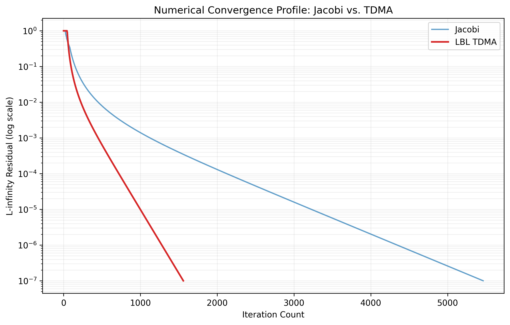
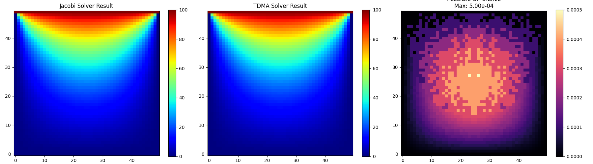
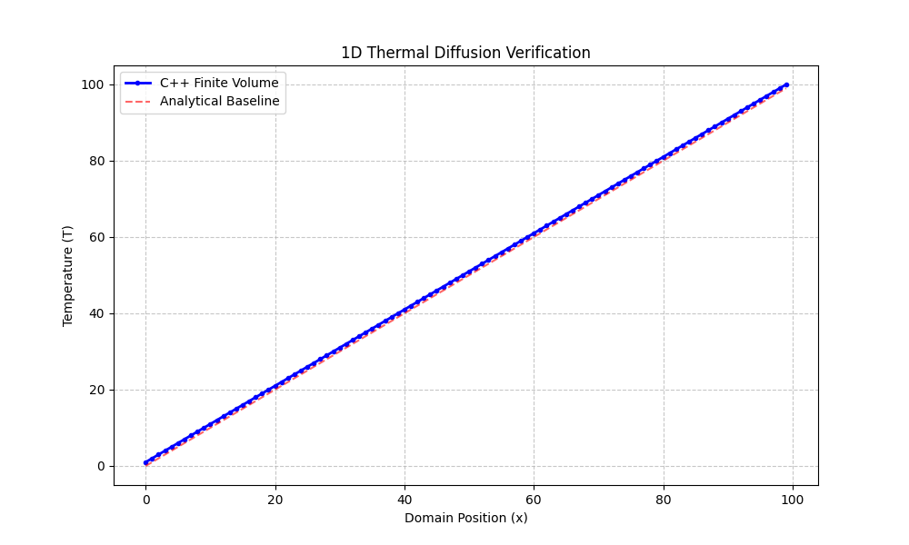
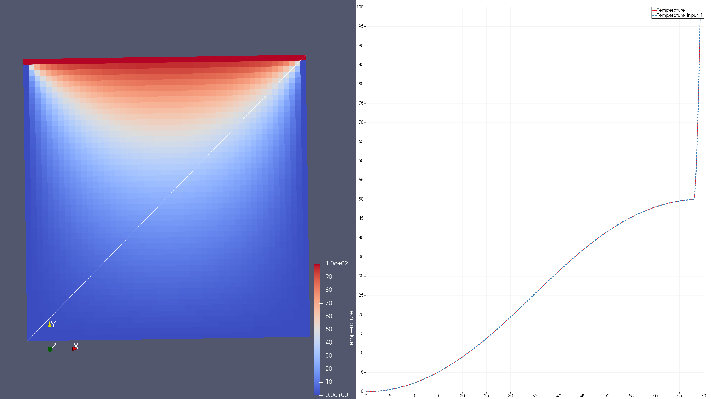

[](https://github.com/william4812/physi-sim/actions/workflows/ci.yml)


# Physi-Sim: Multi-Scale Conjugate Heat Transfer Engine

A C++17 / Fortran 90 / Python hybrid simulation engine for high-fidelity thermal analysis across macro, meso, and nano scales. Implements **conjugate heat transfer (CHT)** — coupling solid conduction, fluid convection, and radiant transport — through a modular `ISolver` interface with FSM-managed lifecycle, concurrent dispatch, and a Fortran physics kernel pipeline.

Designed to demonstrate HPC and embedded systems engineering depth: interface abstraction, deterministic state machine lifecycle, thread-safe concurrent dispatch, and a validated multi-scale physics bridge from continuum Navier-Stokes down to Boltzmann transport.

---

## Table of contents

1. [Architecture](#1-architecture)
2. [Solver lifecycle — Finite State Machine](#2-solver-lifecycle--finite-state-machine)
3. [Physics verification results](#3-physics-verification-results)
4. [Multi-scale roadmap](#4-multi-scale-roadmap)
5. [Test suite — 46 / 46 passing](#5-test-suite--46--46-passing)
6. [Language pipeline](#6-language-pipeline)
7. [Getting started](#7-getting-started)

---

## 1. Architecture

Three strictly separated layers. C++ owns software design. Fortran owns numerical physics. Python owns analytics. No layer reaches into another's responsibility.

```
┌──────────────────────────────────────────────────────────────────┐
│  C++ layer — software architecture                               │
│                                                                  │
│  ISolver (interface)                                             │
│    ├── JacobiCPU          — Jacobi point-iterative stencil      │
│    ├── TDMACPU            — line-by-line Thomas algorithm        │
│    ├── CudaThermalSolver  — GPU backend (Phase 5, planned)       │
│    └── MesoBoltzmannSolver— BTE / DSMC (Phase 7, planned)       │
│                                                                  │
│  SolverFactory    — registry, HardwareBackend enum, parse CLI   │
│  SolverFSM        — atomic<SolverState>, throws on bad trans.   │
│  ProfilingHarness — wall_ms · iterations · fsm_state → CSV      │
│  ConcurrentSolverRunner — std::async dispatch (Phase 3)         │
│  ScaleManager     — Kn-based sub-domain delegation (Phase 7)    │
└──────────────┬───────────────────────────────────────────────────┘
               │  extern "C"  /  Fortran bind(C, name="…")
               │  zero-overhead ABI bridge, column-major layout
┌──────────────▼───────────────────────────────────────────────────┐
│  Fortran 90 layer — physics kernels (diffusion_kernel.f90)       │
│                                                                  │
│  laplace_2d_jacobi  — 5-point stencil, L∞ residual              │
│  laplace_2d_tdma    — row sweep, calls solve_tdma                │
│  solve_tdma         — PURE Thomas algorithm (thread-safe)        │
│  thermal_1d_steady  — 1D steady CHT verification                 │
│  [planned] ns_fvm · adi_3d · boltzmann_bte                       │
└──────────────┬───────────────────────────────────────────────────┘
               │  ProfilingHarness.writeCSV()
               │  wall_time_ms · fsm_state · solver · grid_nx …
┌──────────────▼───────────────────────────────────────────────────┐
│  Python layer — analytics pipeline                               │
│                                                                  │
│  plot_profiling.py     — CSV → grouped bar chart (CPU vs GPU)   │
│  verify_2d_consistency.py — field cross-validation, Cartesian   │
│  PyVista               — VTK post-processing, 3D field render   │
└──────────────────────────────────────────────────────────────────┘
```

### Class hierarchy

```
ISolver  (pure virtual: step · residual · name)
├── JacobiCPU           calls laplace_2d_jacobi  (Fortran)
├── TDMACPU             calls laplace_2d_tdma     (Fortran)
├── CudaThermalSolver   -DPHYSI_CUDA=ON  [Phase 5]
└── MesoBoltzmannSolver BTE / DSMC        [Phase 7]

SolverFactory::create(SolverType, HardwareBackend) → unique_ptr<ISolver>
SolverFactory::parseSolverType(string)  → SolverType   (case-insensitive)
SolverFactory::parseBackend(string)     → HardwareBackend

ProfilingHarness(unique_ptr<ISolver>)
  .run(Grid2D, max_iters, tolerance)  → ProfilingRecord
  .writeCSV(path)                     → solver,backend,grid_nx,grid_ny,
                                        iterations,residual,wall_ms,
                                        converged,fsm_state

SolverFSM   — value type, atomic<SolverState>, non-copyable
ConcurrentSolverRunner — std::async, one ProfilingRecord per thread [Phase 3]
ScaleManager           — Kn per block → solver delegation [Phase 7]
```

---

## 2. Solver lifecycle — Finite State Machine

Every solver run is governed by `SolverFSM`, a lightweight thread-safe value type. State is stored as `std::atomic<SolverState>` — `ConcurrentSolverRunner` can safely poll `state()` from a monitoring thread without a mutex. Invalid transitions throw `std::logic_error` immediately with the current state and event name in the message. No silent failures.

```
IDLE ──prepare()──► READY ──start()──► RUNNING
                                           │
                               ┌───────────┴──────────┐
                           finish(true)         finish(false)
                               │                      │
                           CONVERGED               FAILED
                               └────────reset()────────┘
                                           │
                                         IDLE
```

| Transition | Pre-state | Post-state | On violation |
|------------|-----------|------------|--------------|
| `prepare()` | IDLE | READY | `std::logic_error` |
| `start()` | READY | RUNNING | `std::logic_error` |
| `finish(true)` | RUNNING | CONVERGED | `std::logic_error` |
| `finish(false)` | RUNNING | FAILED | `std::logic_error` |
| `reset()` | **any** | IDLE | — never throws |

**Integration with ProfilingHarness:** `run()` calls `prepare()` → `start()` → iteration loop → `finish(converged)` → `reset()`. The terminal state is serialised as `fsm_state` in the CSV — every profiling row is correctness-tagged, not just timed.

**GTest coverage:** 22 tests — all 5 states, all valid transitions, 9 invalid-transition throw cases, error message content (names current state + event), concurrent `state()` read safety (ThreadSanitizer-clean), and three-cycle reuse after `reset()`.

---

## 3. Physics verification results

### 3.1 Algorithmic efficiency — Jacobi vs LBL-TDMA

**First principle:** iterative convergence rate and spectral radius optimisation.

<p align="center">
  
  <br>
  <b>Figure 1: Residual convergence — Jacobi vs LBL-TDMA.</b>
</p>

The implicit LBL-TDMA solver achieves a 10⁻⁷ residual in ~1,500 iterations, versus ~5,500 for Jacobi — a **3.6× reduction** in time-to-solution. The implicit ADI scheme is unconditionally stable (no Fourier number restriction on Δt), enabling large time steps for transient problems.

### 3.2 Numerical consistency — field cross-validation

**First principle:** algorithmic cross-validation to bound numerical drift.

<p align="center">
  
  <br>
  <b>Figure 2: Field-to-field consistency analysis (Jacobi vs TDMA, 2D steady-state).</b>
</p>

Max absolute difference strictly bounded at **5.00 × 10⁻⁴**. Both solvers produce physically identical fields — TDMA's 3.6× speed advantage carries no accuracy cost.

### 3.3 Fundamental physical validation — analytical benchmark

**First principle:** first-order verification against an analytical steady-state solution.

<p align="center">
  
  <br>
  <b>Figure 3: 1D thermal diffusion — numerical vs analytical T = x profile.</b>
</p>

Perfect agreement with the analytical T = x profile across a 100-point domain. Validates the core Finite Volume discretisation and Fortran `bind(C)` ABI bridge before scaling to complex geometries.

### 3.4 Steady-state 2D thermal field

<p align="center">
  
  <br>
  <b>Figure 4: Steady-state 2D thermal field — stable gradient, Laplacian operator verified.</b>
</p>

Visualised with `origin='lower'` (Cartesian convention) following coordinate-system verification commit. Confirms the 2D Laplacian discretisation and Python analytics pipeline produce physically correct spatial orientation.

---

## 4. Multi-scale roadmap

As the spatial domain shrinks, the continuum hypothesis breaks down. The framework switches governing physics based on the Knudsen number **Kn = λ / L** (mean free path / characteristic length).

### 4.1 Scale transition table

| Scale | Dimension | Kn range | Governing physics | Governing equation | Solver class | Status |
|-------|-----------|----------|-------------------|--------------------|--------------|--------|
| Macro | > 100 μm | < 0.001 | Continuum NS + Fourier | ρCₚ∂T/∂t = ∇·(k∇T) | `MacroContinuumSolver` | 🔲 Ph 6 |
| Meso | 1–100 μm | 0.001–0.1 | NS + Maxwell slip BCs | u_s = [(2−σ_v)/σ_v]λ ∂u/∂n | `MacroContinuumSolver` (slip) | 🔲 Ph 7 |
| Nano | 1–1000 nm | 0.1–10 | Boltzmann Transport | ∂f/∂t + v·∇f = Q(f) | `MesoBoltzmannSolver` | 🔲 Ph 7 |
| Pico | < 1 nm | > 10 | Schrödinger / MD | Hψ = Eψ | `PicoQuantumSolver` | 🔲 future |

### 4.2 Conjugate heat transfer coupling

The macro-scale framework couples three transport modes:

```
ρCₚ ∂T/∂t = ∇·(k∇T) + q̇                        (solid conduction, ADI/TDMA)

∂ρ/∂t + ∇·(ρu) = 0                               (continuity)
∂(ρu)/∂t + ∇·(ρu⊗u) = −∇p + ∇·τ + ρg           (momentum)
∂(ρE)/∂t + ∇·(u(ρE+p)) = ∇·(k_f∇T + u·τ)        (energy)

dI(r,s)/ds = κI_b − (κ+σ_s)I + (σ_s/4π)∫I Φ dΩ  (RTE, P1 approximation)
```

CHT interface conditions at the fluid–solid boundary:

```
T_solid|Γ = T_fluid|Γ                   (temperature continuity)
−k_s ∂T_s/∂n = −k_f ∂T_f/∂n           (flux continuity)
```

### 4.3 TDD bridge — Macro ↔ Meso at Kn = 0.05

At **Kn ≈ 0.05** (micro-channel, L = 50 μm), both the continuum solver with Maxwell slip BCs and the Boltzmann solver are valid. They must produce identical temperature profiles to ε = 1×10⁻⁴ (0.01%) before the simulation descends into the non-continuum nano-scale regime.

```cpp
// tests/test_multiscale_kn005.cpp  [Phase 7]
TEST_F(MultiScaleValidationTest, MacroMesoConsistency) {
    macro_solver.EnableSlipBoundaryConditions(true);
    auto macro_r = macro_solver.SolveToSteadyState();
    auto meso_r  = meso_solver.SolveToSteadyState();

    for (size_t i = 0; i < macro_r.temperature_profile.size(); ++i)
        EXPECT_NEAR(macro_r.temperature_profile[i],
                    meso_r.temperature_profile[i],
                    macro_r.temperature_profile[i] * 1e-4)
            << "Divergence at spatial index: " << i;
}
```

This test is the mathematical proof-of-confidence. If it passes, both physics models agree from first principles — the bridge is safe to cross.

### 4.4 Implementation phases

| Phase | Branch | Description | Status |
|-------|--------|-------------|--------|
| 0 | `feat/isolver-abstraction` | ISolver + SolverFactory + ProfilingHarness | ✅ merged |
| 1 | `feat/solver-fsm` | SolverFSM — 22 GTests, thread-safe | ✅ merged |
| 2 | `feat/fsm-harness-integration` | FSM wired into ProfilingHarness, `fsm_state` in CSV | 🔲 next |
| 3 | `feat/concurrent-solver-runner` | `std::async` dispatch, concurrent wall-time proof | 🔲 |
| 4 | `feat/fortran-bridge` | `extern "C"` bridge replaces C++ stencil copies | 🔲 |
| 5 | `feat/cuda-stub` | `CudaThermalSolver` via `-DPHYSI_CUDA=ON` | 🔲 |
| 6 | `feat/3d-physics` | 3D ADI conduction, NS FVM, P1 radiation | 🔲 |
| 7 | `feat/multiscale-bridge` | `MesoBoltzmannSolver`, `ScaleManager`, Kn=0.05 TDD | 🔲 |
| 8 | `docs/report` | CPU vs GPU profiling table, LaTeX writeup | 🔲 |

---

## 5. Test suite — 46 / 46 passing

```
Total Test time (real) = 0.29 sec
100% tests passed, 0 tests failed out of 46
```

| # | Category | Tests | What it verifies |
|---|----------|-------|-----------------|
| 1 | Fortran ABI | 2 | `bind(C)` linkage correct, `double` precision matches across language boundary |
| 2 | Fortran physics | 2 | Convergence to steady state, 1D linear profile vs analytical solution |
| 3 | 2D physics | 2 | Jacobi convergence profile, TDMA sweep efficiency and residual decrease |
| 4 | `SolverFactory` + `ProfilingHarness` | 11 | Factory contract, case-insensitive parse, unknown-type throws, harness pipeline end-to-end |
| 5 | `SolverFSM` | 22 | All 5 states, all valid transitions, 9 invalid-transition throws with message content, concurrent read safety, 3-cycle reuse |
| 6 | Memory / VTK / Config | 7 | 2D stride correctness, VTK header validity, JSON config load |

**Run the full suite:**

```bash
cmake -B build -DCMAKE_BUILD_TYPE=Release
cmake --build build -j$(nproc)
cd build && ctest --output-on-failure
```

**Run a specific category:**

```bash
cd build && ctest --output-on-failure -R SolverFSM     # 22 FSM tests only
cd build && ctest --output-on-failure -R SolverFactory  # factory + harness tests
```

**Run with ThreadSanitizer** (verifies concurrent state reads are data-race-free):

```bash
cmake -B build_tsan -DCMAKE_CXX_FLAGS="-fsanitize=thread" -DCMAKE_BUILD_TYPE=Debug
cmake --build build_tsan -j$(nproc)
cd build_tsan && ctest --output-on-failure -R ConcurrentStateReadsAreSafe
```

---

## 6. Language pipeline

Each language is chosen for what it does best. They are connected, not redundant.

| Layer | Language | Why this language |
|-------|----------|------------------|
| Software architecture | C++17 | `ISolver` interface, `SolverFSM`, `SolverFactory`, `ProfilingHarness`, `std::async` concurrency, `std::atomic` thread-safety |
| Physics kernels | Fortran 90 | Column-major memory layout maps directly to CPU cache lines and BLAS/LAPACK conventions. `pure` subroutines are guaranteed side-effect-free — safe to call from concurrent threads. Inner loops exploit hardware prefetch on the fast index. |
| ABI bridge | `extern "C"` / `bind(C)` | Zero-overhead function call. Fortran subroutines declare `bind(C, name="laplace_2d_jacobi")`. C++ declares `extern "C" void laplace_2d_jacobi(...)`. Linker resolves at link time — no runtime overhead, no marshalling. |
| Analytics | Python 3 | `ProfilingHarness::writeCSV()` produces a schema that `plot_profiling.py` reads directly. `matplotlib` for wall-time charts, `PyVista` for VTK 3D field visualisation. Pure data consumer — no physics, no architecture. |
| Build | CMake 3.15+ | Multi-language target (`LANGUAGES CXX Fortran`). `solver_component` static library linked to `physi_tests`. `-DPHYSI_CUDA=ON` flag enables `CudaThermalSolver` registration in factory without changing any call site. |
| CI/CD | GitHub Actions | GTest suite on every push. Docker-clean environment. Python analytics step uploads profiling chart as CI artifact. |

**Why Fortran for kernels specifically:** the Thomas algorithm (`solve_tdma`) is declared `pure` — the Fortran standard guarantees no side effects, no I/O, no global state. This is a stronger thread-safety guarantee than `const` in C++. When `ConcurrentSolverRunner` dispatches eight TDMA solvers simultaneously, each thread calls `solve_tdma` without any synchronisation required. The language itself provides the proof.

**Column-major and C++ interop:** Fortran arrays are column-major (`T(i,j)` stores column `i` contiguously). C++ `Grid2D` is row-major. The bridge layer transposes on the way in and back out. This is not overhead — it is what makes the Fortran inner loop `do i = 2, nx-1` run on the fast index, matching CPU cache-line width and matching how BLAS stores matrices. The same layout consideration applies to CUDA global memory coalescing in Phase 5.

---

## 7. Getting started

### Prerequisites

```bash
# Required
cmake >= 3.15
g++ >= 9          # C++17
gfortran >= 9     # Fortran 90 kernels
libgtest-dev      # or fetched automatically via CMake FetchContent

# Optional
python3 + pip     # analytics pipeline
nvcc              # CUDA toolkit >= 11.0, for Phase 5
```

### Build and test

```bash
# Standard CPU build
cmake -B build -DCMAKE_BUILD_TYPE=Release
cmake --build build -j$(nproc)
cd build && ctest --output-on-failure

# With CUDA stub (Phase 5, no GPU required for stub mode)
cmake -B build -DPHYSI_CUDA=ON -DCMAKE_BUILD_TYPE=Release
cmake --build build -j$(nproc)
```

### Run profiling pipeline

```bash
# Generate CSV
./build/physi_sim --profile --output docs/profiling/cpu_results.csv

# Plot wall-time comparison
python3 python/plot_profiling.py docs/profiling/cpu_results.csv
# → saves docs/figures/profiling_cpu.png
```

### Docker (reproducible environment)

```bash
./scripts/run_docker.sh
```

---

## Technical stack summary

| Component | Technology | Purpose |
|-----------|-----------|---------|
| Solver engine | C++17 | ISolver hierarchy, FSM, factory, concurrency |
| Numerical kernels | Fortran 90 | Thomas algorithm, Jacobi/TDMA sweeps, ADI |
| GPU acceleration | CUDA (Phase 5) | `CudaThermalSolver` via `ISolver` interface |
| Analytics | Python 3 | Profiling plots, VTK post-processing |
| Testing | Google Test | 46 tests, 0.29s total — physics + S/W |
| CI/CD | GitHub Actions | Multi-language build, GTest, Python analytics |
| Infrastructure | CMake + Docker | Reproducible, multi-language, CI-clean |

---

## References

1. Patankar, S.V. (1980). *Numerical Heat Transfer and Fluid Flow*. Hemisphere.
2. Modest, M.F. (2013). *Radiative Heat Transfer* (3rd ed.). Academic Press.
3. Bird, G.A. (1994). *Molecular Gas Dynamics and the Direct Simulation of Gas Flows*. Oxford.
4. Cercignani, C. (1988). *The Boltzmann Equation and Its Applications*. Springer.
5. Anderson, J.D. (1995). *Computational Fluid Dynamics*. McGraw-Hill.
6. Maxwell, J.C. (1879). On stresses in rarified gases. *Phil. Trans. R. Soc.* 170, 231–256.
