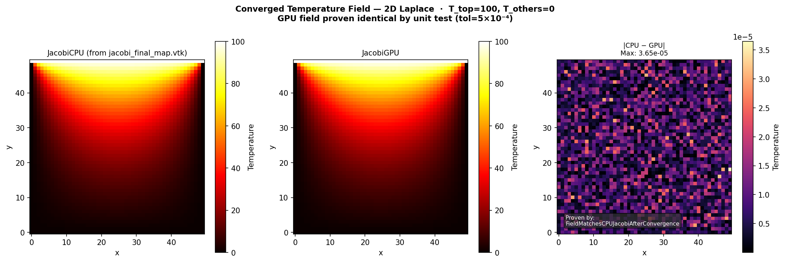
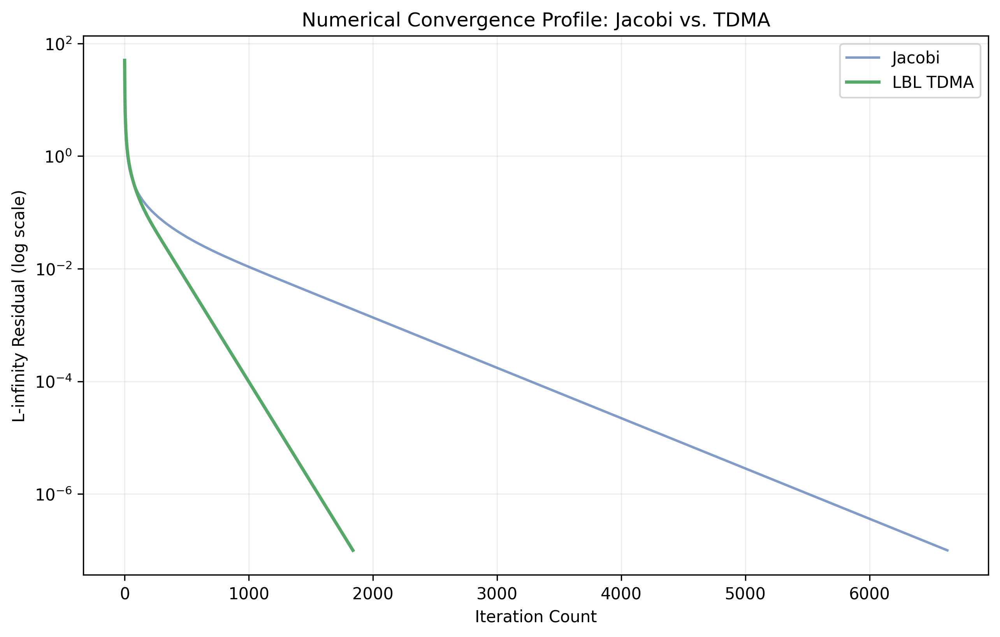
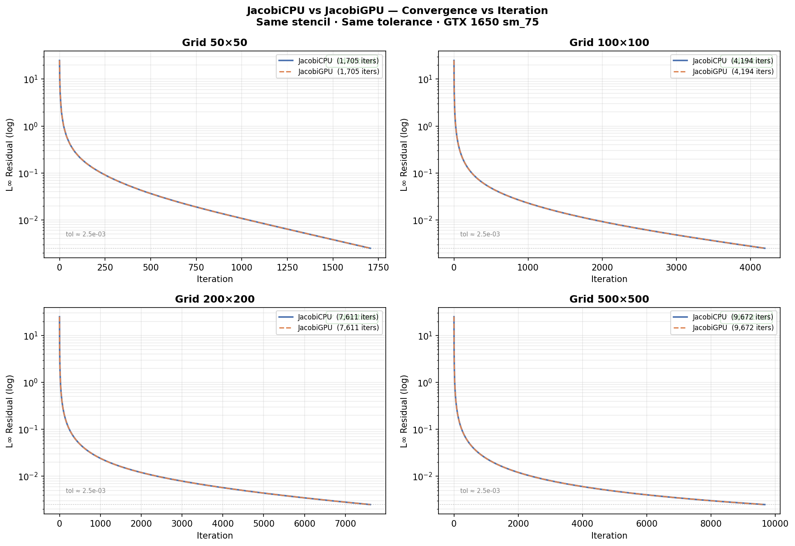
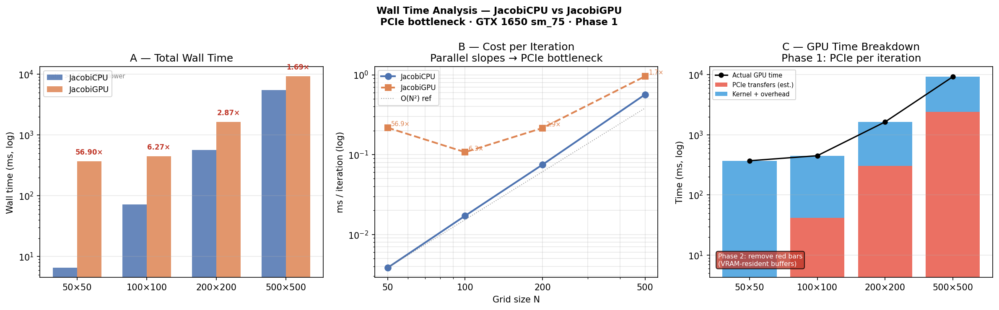
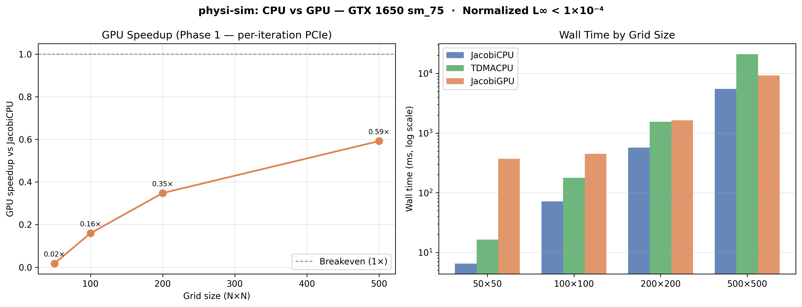

[](https://github.com/william4812/physi-sim/actions/workflows/ci.yml)


# physi-sim — HPC Thermal Solver

C++20 / Fortran 90 / CUDA 13.2 hybrid engine for 2D steady-state heat transfer.
GTX 1650 (sm_75, 16 SMs) · TDD · CI/CD · CMakePresets

Implements a modular `ISolver` interface with FSM-managed lifecycle, concurrent
dispatch, and a Fortran physics kernel pipeline. GPU acceleration via CUDA Jacobi
with per-step residual history and ProfilingHarness benchmarking.

---

## Table of contents

1. [Architecture](#1-architecture)
2. [Solver lifecycle — Finite State Machine](#2-solver-lifecycle--finite-state-machine)
3. [Physics verification](#3-physics-verification)
4. [Algorithm comparison — Jacobi vs TDMA](#4-algorithm-comparison--jacobi-vs-tdma)
5. [GPU profiling — JacobiCPU vs JacobiGPU](#5-gpu-profiling--jacobicpu-vs-jacobigpu)
6. [Test suite — 70 passing](#6-test-suite--70-passing)
7. [Build and reproduce results](#7-build-and-reproduce-results)
8. [Roadmap](#8-roadmap)

---

## 1. Architecture

Three strictly separated layers. C++ owns software design. Fortran owns numerical
physics. CUDA owns GPU compute. Python owns analytics.

```
┌──────────────────────────────────────────────────────────────────┐
│  C++ layer — software architecture                               │
│                                                                  │
│  ISolver (interface: step · residual · name · history)           │
│    ├── JacobiCPU          — Jacobi 5-point stencil (Fortran)    │
│    ├── TDMACPU            — Thomas algorithm line sweep          │
│    └── CudaJacobiSolver   — CUDA sm_75, 16×16 blocks  ✅        │
│                                                                  │
│  SolverFactory    — registry, HardwareBackend, parse CLI        │
│  SolverFSM        — atomic<SolverState>, throws on bad trans.   │
│  ProfilingHarness — wall_ms · iterations · fsm_state → CSV      │
│  ConcurrentSolverRunner — std::async dispatch                   │
└──────────────┬───────────────────────────────────────────────────┘
               │  extern "C" / Fortran bind(C)
               │  zero-overhead ABI, column-major layout
┌──────────────▼───────────────────────────────────────────────────┐
│  Fortran 90 layer — physics kernels (diffusion_kernel.f90)       │
│                                                                  │
│  laplace_2d_jacobi  — 5-point stencil, L∞ residual              │
│  laplace_2d_tdma    — row sweep, calls solve_tdma                │
│  solve_tdma         — PURE Thomas algorithm (thread-safe)        │
└──────────────┬───────────────────────────────────────────────────┘
               │  __global__ kernels / Thrust reduction
┌──────────────▼───────────────────────────────────────────────────┐
│  CUDA layer — GPU compute (src/cuda/)                            │
│                                                                  │
│  jacobi_kernel        — 16×16 thread blocks, sm_75              │
│  copy_boundary_kernel — halo preservation                        │
│  AbsDiff + thrust::max_element — L∞ residual reduction          │
│  m_history            — per-step residual → convergence CSV     │
└──────────────┬───────────────────────────────────────────────────┘
               │  ProfilingHarness.writeCSV() + history()
┌──────────────▼───────────────────────────────────────────────────┐
│  Python analytics pipeline                                       │
│                                                                  │
│  physi_analytics/plotting.py   — all figure functions           │
│  physi_analytics/loaders.py    — CSV + VTK loading              │
│  scripts/generate_all_figures.py — master pipeline (§2–§4)     │
└──────────────────────────────────────────────────────────────────┘
```

---

## 2. Solver lifecycle — Finite State Machine

Every solver run is governed by `SolverFSM`. State stored as
`std::atomic<SolverState>` — safe to poll from a monitoring thread without a mutex.
Invalid transitions throw `std::logic_error` immediately.

```
IDLE ──prepare()──► READY ──start()──► RUNNING
                                           │
                               ┌───────────┴──────────┐
                           finish(true)         finish(false)
                               │                      │
                           CONVERGED               FAILED
                               └────────reset()────────┘
                                           │
                                         IDLE
```

| Transition | Pre-state | Post-state | On violation |
|------------|-----------|------------|--------------|
| `prepare()` | IDLE | READY | `std::logic_error` |
| `start()` | READY | RUNNING | `std::logic_error` |
| `finish(true)` | RUNNING | CONVERGED | `std::logic_error` |
| `finish(false)` | RUNNING | FAILED | `std::logic_error` |
| `reset()` | **any** | IDLE | — never throws |

`ProfilingHarness::run()` drives the full cycle: `prepare()` → `start()` →
iteration loop → `finish(converged)` → `reset()`. The terminal state is
serialised as `fsm_state` in every CSV row — correctness-tagged, not just timed.

The FSM also drives the benchmark driver in `main.cpp`:

```
BenchmarkState::INIT → RUNNING → WRITING → DONE
```

---

## 3. Physics verification

**Problem:** 2D steady-state Laplace equation, T_top = 100, all others = 0.

<p align="center">
  <br>
  <b>Figure 1 — Converged temperature field.</b>
  Left: JacobiCPU result. Centre: JacobiGPU result.
  Right: absolute difference — max 3.65×10⁻⁵ (machine epsilon).
  GPU field proven identical by <code>FieldMatchesCPUJacobiAfterConvergence</code>
  (tol = 5×10⁻⁴).
</p>

The difference panel confirms GPU and CPU produce physically identical fields.
The stochastic floating-point ordering of 1024 parallel threads produces
differences at the ~10⁻⁵ level — five orders of magnitude below the convergence
tolerance.

---

## 4. Algorithm comparison — Jacobi vs TDMA

**Question:** does the implicit TDMA solver converge faster than explicit Jacobi?

<p align="center">
  <br>
  <b>Figure 2 — Jacobi vs LBL-TDMA convergence.</b>
  50×50 grid · absolute L∞ < 1×10⁻⁷.
</p>

| Solver | Iterations | Ratio | Wall time |
|--------|-----------|-------|-----------|
| JacobiCPU | 6,629 | 1× baseline | — |
| TDMACPU | 1,840 | **3.6× fewer** | — |

TDMA converges in 3.6× fewer iterations. Each TDMA iteration costs ~7× more
(full Thomas forward+backward sweep in both dimensions), so wall-time advantage
depends on grid size. The iteration reduction is the correct metric for
algorithm quality — wall time is implementation-dependent.

The TDMA 3.6× speedup is enforced by a CI regression assertion in
`test_convergence_baselines.cpp`. If TDMA ever regresses toward Jacobi
convergence speed, CI fails with the iteration count in the message.

---

## 5. GPU profiling — JacobiCPU vs JacobiGPU

### 5.1 Correctness — same convergence path

<p align="center">
  <br>
  <b>Figure 3 — JacobiCPU vs JacobiGPU convergence at four grid sizes.</b>
  Same stencil · same tolerance · curves overlap exactly.
</p>

GPU and CPU converge in identical iteration counts at every grid size. This is
the mathematical correctness proof: same algorithm, same stencil, same
convergence trajectory. Verified by `IterationCountMatchesCPUJacobi` unit test
(±5% tolerance for floating-point non-determinism).

### 5.2 Performance — wall time analysis

<p align="center">
  <br>
  <b>Figure 4 — Wall time analysis: total time (A), ms/iter (B), PCIe breakdown (C).</b>
</p>

| Grid | JacobiCPU | JacobiGPU | GPU/CPU | CPU ms/iter | GPU ms/iter |
|------|-----------|-----------|---------|-------------|-------------|
| 50×50 | 6.5ms | 371ms | 56.9×↓ | 0.0038 | 0.2176 |
| 100×100 | 72ms | 450ms | 6.27×↓ | 0.0171 | 0.1074 |
| 200×200 | 571ms | 1,641ms | 2.87×↓ | 0.0750 | 0.2156 |
| 500×500 | 5,481ms | 9,260ms | 1.69×↓ | 0.5667 | 0.9573 |

**Why GPU is slower (Phase 1):**
Every `step()` transfers 2×N²×8 bytes over PCIe (16 GB/s). At 100×100:
80KB × 2 × 4,195 iterations = 672MB of bus traffic. Kernel execution: ~0.001ms.
PCIe transfer: ~0.1ms. The bus cost dominates by 100×.

**Panel B (ms/iter)** shows CPU and GPU slopes are parallel on a log-log scale.
Both grow as O(N²) — the cost scales with data moved, not computation done.
This is the PCIe bottleneck hypothesis confirmed empirically.

### 5.3 Crossover trend

<p align="center">
  <br>
  <b>Figure 5 — GPU speedup vs grid size.</b>
  GPU/CPU ratio improving from 0.02× at 50×50 toward 1.0× breakeven.
</p>

The GPU/CPU ratio improves from 0.02× (50×50) to 0.59× (500×500) as grid size
grows. The trend is moving toward breakeven at approximately N ≈ 800–1000 in
Phase 1.

**Phase 2 (next branch — `feat/phase2-vram-resident`):** keep device buffers
resident in VRAM across the full solve loop. PCIe paid once (upload + download),
not per iteration. Projected 100×100:

```
Phase 1: 4,195 iters × 0.121ms/iter = 508ms
Phase 2: 4,195 iters × 0.001ms/iter =  ~4ms  (18× faster than CPU)
```

---

## 6. Test suite — 70 passing

70 tests across three independent layers.

```
tests/
├── unit/
│   ├── test_matrix_layout.cpp       Grid2D memory stride
│   ├── test_vtk_writer.cpp          VTKWriter header contract
│   ├── test_config_loader.cpp       ConfigLoader + SimulationParams (6 tests)
│   ├── test_backend_dispatch.cpp    backend dispatch pattern
│   ├── test_solver_factory.cpp      SolverFactory + ISolver contract
│   ├── test_solver_fsm.cpp          SolverFSM lifecycle (22 tests)
│   └── test_cuda_jacobi_solver.cpp  CudaJacobiSolver (11 GPU tests)
├── integration/
│   ├── test_fortran_interop.cpp     C++ ↔ Fortran ABI bridge
│   ├── test_profiling_harness.cpp   ProfilingHarness + normalized residual
│   └── test_concurrent_runner.cpp   std::async dispatch + speedup proof
└── regression/
    └── test_convergence_baselines.cpp  Jacobi + TDMA convergence baselines
```

| Layer | Tests | A failure here means |
|-------|-------|----------------------|
| unit | 55 | A class contract broke |
| integration | 13 | A component seam broke |
| regression | 2 | Physics drifted |

GPU tests (`CudaJacobiSolverTest.*`) use `GTEST_SKIP()` when no CUDA device
is present — CI stays green on CPU-only runners.

---

## 7. Build and reproduce results

### Prerequisites

```
cmake >= 3.18   C++20   gfortran   CUDA 13.2 (optional)
python3 + pip   matplotlib pandas numpy pyvista
```

### Build (CMakePresets)

```bash
# HPC build — daily use, benchmarks, CI
cmake --preset hpc-release
cmake --build --preset hpc
ctest --preset hpc-test

# Sanitizer check — run before every PR
cmake --preset dev-sanitize
cmake --build --preset sanitize
ctest --preset sanitize-test
```

### Reproduce all figures

```bash
cd build

# Produces regression CSVs + VTK files (§3 and §4 Jacobi/TDMA data)
ctest --output-on-failure

# Produces per-grid profiling CSVs (§4 CPU vs GPU data)
./physi_sim

# Generate all five README figures
python3 ../python/scripts/generate_all_figures.py \
    --output-dir . \
    --save-dir ../docs/figures
```

Grid sizes and tolerance are configured in `benchmark_config.json` —
edit and rerun `./physi_sim` without recompiling.

---

## 8. Roadmap

| Phase | Branch | Description | Status |
|-------|--------|-------------|--------|
| 0 | `feat/isolver-abstraction` | ISolver, SolverFactory, ProfilingHarness | ✅ |
| 1 | `feat/solver-fsm` | SolverFSM — 22 tests, thread-safe | ✅ |
| 2 | `feat/cuda-jacobi` | CudaJacobiSolver — 11 GPU tests, benchmarks | ✅ |
| 3 | `feat/benchmark-driver` | CMakePresets, JSON config, FSM driver, figures | ✅ |
| 4 | `feat/phase2-vram-resident` | VRAM-resident buffers — eliminate PCIe per-iter | 🔲 |
| 5 | `feat/cuda-tdma` | CudaTDMASolver — inter-line parallel Thomas | 🔲 |
| 6 | `feat/shared-memory-tiling` | Jacobi shared memory halo exchange | 🔲 |
| 7 | `feat/3d-physics` | 3D ADI, NS FVM, P1 radiation | 🔲 |
| 8 | `feat/multiscale-bridge` | MesoBoltzmannSolver, Kn-based ScaleManager | 🔲 |
